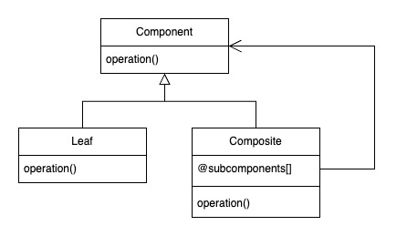

# Composite Pattern

The Composite pattern lets us build arbitrarily deep *trees* of objects in which we can treat any of the interior nodes—the composites—just like any of the leaf nodes

## Class Diagram

