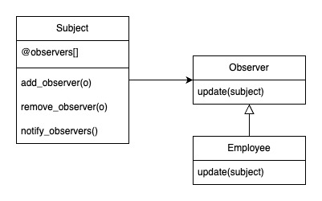

# Observer Pattern

The Observer pattern allows you to build components that know about the activities of other components without having to tightly couple everything together in an unmanageable mess of code-flavored spaghetti. By creating a clean interface between the source of the news (the observable object) and the consumer of that news (the observers), the Observer pattern moves the news without tangling things up.

Most of the work in implementing the Observer pattern occurs in the subject or observable class. In Ruby, we can factor that mechanism out into either a superclass or (more likely) a module. The interface between observer and observable can be a complex as you like, but if you are building a simple observer, **code blocks work well**.

## Ruby's builtin Observable module

https://ruby-doc.org/stdlib-3.0.0/libdoc/observer/rdoc/Observable.html

## Observer Vs Strategy Pattern

the Observer pattern and the Strategy pattern look a bit alike: Both feature an object (called the observable in the Observer pattern and the context in the Strategy pattern) that makes calls out to some other object (either the observer or the strategy). The difference is mostly one of intent. In the case of the observer, we are informing the other object of the events occurring back at the observable.
In the case of the strategy, we are getting the strategy object to do some computing.

## Class Diagram

